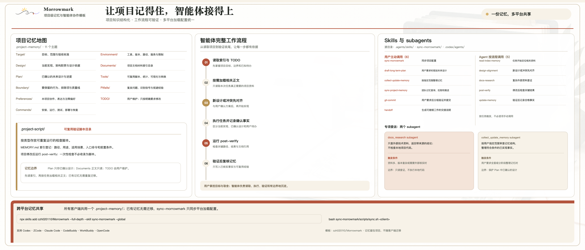

# Morrowmark: Vibe Coding 项目持久化与记忆管理

<p align="center">
  
</p>

**面向 Codex、ZCode、Claude Code、CodeBuddy、WorkBuddy 和 OpenCode 的项目记忆与编码 Agent 工作流。**

<p align="center">
  <a href="README.md">English</a> | <strong>简体中文</strong>
</p>

<p align="center">
  <a href="https://github.com/czh020110/Morrowmark"></a>
</p>

**让项目记得住，也让 Agent 接得上。**

Morrowmark 为每个仓库维护长期的项目上下文：把已确认的当前事实与已确定的预期设计分开，并让 Agent 按任务读取相关主题。配套的 skills 和 subagents 将计划、文档查询、验证和记忆更新等工作流程带到六种编码客户端。记忆保存在项目仓库中，不写入客户端的全局记忆。

<p align="center">
  
</p>

## 记忆记录什么

- **项目事实：** 项目目的与范围（`Target`）、当前实现（`Design`）、必须遵守的边界与项目偏好（`Boundary`、`Preferences`）。
- **工作知识：** 命令、环境、项目文档、可复用工具和反复出现的问题经验（`Commands`、`Environment`、`Documents`、`Tools`、`Pitfalls`）。
- **未来设计：** 已确定但尚未实现的设计（`Plan/`）。`TODO/TODO.md` 则由用户维护。

## 任务流程

1. 先读各主题索引和 TODO，再按需读取相关记忆正文。
2. 项目级偏好或边界明确后即可记录；反复出现且一致的信号也可标为推断后记录。
3. 执行用户要求的项目工作；每次修改交付前都必须运行 `post-verify`。
4. `post-verify` 通过后，统一进行一次最终记忆整理：记录实现事实、处理与现有记忆的冲突，并写入已确认具有复用价值和复发风险的执行经验。不记录未验证说法或临时进度。

## 在已有代码仓库中开始使用

1. 先运行 `sync-morrowmark`，将模板配置同步到目标仓库。
2. 然后明确要求 Agent 使用 `collect-update-memory`，根据仓库中已有的代码进行首次记忆初始化和整理。
3. 完成首次整理后，Agent 会在日常会话中按工作流程自动记录符合条件、已确认的项目事实；无需每个任务都手动运行完整记忆同步。

### 何时运行全量记忆同步

拉取远端更新后、积累了多次提交或代码改动、新增文档/材料、需要调整记忆主题结构，或希望全面检查记忆时，可以要求 `collect-update-memory` 运行全量同步。它会先审查记忆结构，再根据已保存基准之后的提交和本地工作区同步符合条件的事实。它不会自行拉取远端数据：代码更新需先拉取；独立的团队记忆仓库则先使用 `sync-project-memory pull`。

事实更新严格按证据来源划分：`Design/`、`Commands/`、`Environment/` 和 `Tools/` 只依据当前代码、脚本和配置；`Target/` 和 `Boundary/` 只依据 `Documents/` 索引的非代码材料正文。如果允许使用的来源不支持真实且相关的变化，Agent 会保持事实不变。全量同步 subagent 不更新 `Preferences/`、`Plan/`、`Pitfalls/` 和 `TODO/` 的事实正文。

Agent 仍可整理主题结构和索引，但遵守以下边界：

- `Plan/` 中的设计正文保持原样，只能整理结构和索引。
- `Documents/` 正文只读；必要时可以更新索引。
- `Preferences/` 和 `Pitfalls/` 可以调整结构，但不会同步或改写其中的事实内容。
- 此 Skill 不会修改用户维护的 `TODO/TODO.md`。

## 快速开始

1. 使用 Vercel Skills CLI 安装并登记全局入口 Skill。以下是 CLI 使用或兼容链接使用的客户端 Skill 目录：

   | 客户端 | 全局 Skill 目录 |
   | --- | --- |
   | Codex、ZCode、OpenCode | `~/.agents/skills/` |
   | Claude Code | `~/.claude/skills/` |
   | CodeBuddy | `~/.codebuddy/skills/` |
   | WorkBuddy 国际版 | `~/.workbuddy-ai/skills/` |
   | WorkBuddy 国内版 | `~/.workbuddy/skills/` |

   也可以使用 Vercel Skills CLI 安装这个 Skill：

   ```bash
   npx skills add czh020110/morrowmark@sync-morrowmark --global
   ```

   `@sync-morrowmark` 后缀会直接选择这个入口 Skill。如果 CLI 提示选择客户端，请选择受支持的客户端。目前 CLI 的 Agent 列表不包含 WorkBuddy；项目初始化时会将 WorkBuddy 的客户端目录链接到登记后的 Skill 源。全局登记后，Skill 可使用 `npx skills update --global sync-morrowmark` 更新自身；项目配置仍需执行第 2 步。更多客户端和参数见 [Skills CLI 文档](https://github.com/vercel-labs/skills)。

首次同步前，请用这个新名称替换之前安装的全局版本。

   也可以把下面这段提示词复制给 Agent：

   ```text
   请使用 `npx skills add czh020110/morrowmark@sync-morrowmark --global` 安装全局 `sync-morrowmark` Skill。如果 CLI 提示选择客户端，请选择它支持的客户端；如果当前客户端是 WorkBuddy，请选择 Codex 作为登记来源，之后由 Skill 将 WorkBuddy 客户端目录链接到该来源。当前会话打开的仓库是目标项目。如果这是首次安装，请读取安装后的 Skill 中的 `references/PROJECT_USAGE.md` 并简要说明 Morrowmark 的使用方式；更新已有安装不算首次安装。然后询问我是否要初始化或更新当前仓库；得到确认前不要执行项目同步。
   ```

2. 在目标仓库中调用全局安装的 `sync-morrowmark` Skill。它会先通过 `npx skills update --global sync-morrowmark` 更新登记的全局 Skill，再运行脚本同步当前仓库的平台配置。若当前平台不受 Skills CLI 识别，Skill 会先将平台全局目录链接到 CLI 管理的 Skill 源，再运行脚本。

同步会生成对应平台的 Agent、Skill 配置并补齐项目记忆模板；会保留现有自定义提示词、累积的记忆正文，以及平台支持的同名 Agent 思考程度设置。

## 项目记忆

记忆保存在 `.project-memory/`，采用“索引 + 正文”的结构。每个主题的 `MEMORY.md` 用于定位对应正文；已确认且可复用的事实写入相关主题正文。

所有支持的客户端都使用目标仓库中的同一个 `.project-memory/` 目录。切换客户端时，无需迁移已有记忆；只需运行 `sync-morrowmark` 为目标客户端生成或更新记忆加载提示和配置。记忆文件保持共享，变化的是客户端适配配置。

| 目录 | 用途 |
| --- | --- |
| `Target/` | 项目目的、范围和验收标准。 |
| `Design/` | 当前实现、架构和设计理由。 |
| `Plan/` | 已确定的未来设计；实现并验证后再标记完成。 |
| `Boundary/` | 必须保留的行为、排除项、约束和质量要求。 |
| `Preferences/` | 项目专属的工作与沟通偏好。 |
| `Commands/` | 安装、运行、构建、测试、部署和故障恢复命令。 |
| `Environment/` | 工具版本、平台限制、路径和外部服务。 |
| `Documents/` | 用户维护的项目文档索引；所引用的文档正文只读。 |
| `Tools/` | 可复用的脚本、可视化和数据转换工具。 |
| `Pitfalls/` | 反复出现的问题、识别方式和规避办法。 |
| `TODO/` | `TODO/TODO.md` 是用户自己的待办清单；只有用户明确要求时 Agent 才修改。 |

**如何维护记忆：** 先读取所有主题索引和 TODO，再按任务读取相关正文；将已确认、可复用的项目事实写入对应主题。`Plan/` 只记录已确定的设计；`TODO/TODO.md` 由用户维护。

## 验证脚本（`.project-script/`）

可复用的验证脚本按类型放在子目录中，并在 `.project-script/MEMORY.md` 登记脚本路径、用途、适用场景、运行命令和前置条件。一次性检查无需保存为脚本。每次修改项目后运行 `post-verify`。当前仓库尚未登记可复用的验证脚本。

## 团队项目记忆协作

`sync-project-memory` 通过独立的远程 Git 仓库共享 `.project-memory/`。脚本根据主代码仓库的 `origin` URL 生成 `docs/<slug>` 分支；使用相同 `origin` 的克隆会对应到同一记忆分支。所有克隆应保持相同的 `origin`；代码仓库 URL 改变时，对应的记忆分支名也会改变。团队成员需在各自设备上使用 Skill 的 `config <URL>` 操作，配置同一个记忆仓库地址。

不指定方向运行 Skill 时，它会检查本地与远端状态，建议拉取、推送或先拉取再推送，并在执行更改前询问。也可直接指定 `pull`、`push` 或 `info`。`pull` 会将远端更新合并到本地记忆，`push` 会发布本地更新。发生冲突时会停止并交由人工处理；脚本不会丢弃本地或远端内容，也不会强制推送。

## Skills

### 用户主动调用

| Skill | 用途 |
| --- | --- |
| `sync-morrowmark` | 安装或更新项目 Agent、Skill 和模板。 |
| `draft-long-term-plan` | 创建或扩展 `Plan/` 中的项目预期设计。 |
| `collect-update-memory` | 根据一段提交和本地改动整理项目记忆。 |
| `sync-project-memory` | 通过独立远程仓库推送或拉取项目记忆。 |
| `git-commit` | 按修改目的分组并创建提交；需用户提出。 |
| `handoff` | 生成可复制到新会话的精简任务交接提示词。 |

### Agent 按流程使用

| Skill | 用途 |
| --- | --- |
| `read-index-memory` | 在任务开始时读取记忆索引，并定位相关正文。 |
| `design-alignment` | 与用户确定设计变更或冲突，并记录确认后的设计。 |
| `docs-research` | 查询多个或较复杂的外部技术文档问题。 |
| `post-verify` | 改动完成后执行最终检查。 |
| `update-memory` | 验证通过后记录已确认的事实。 |

## Subagents

- `collect_update_memory`：检查记忆主题结构并执行完整记忆同步。
- `docs_research`：查询外部技术文档，不检查本地项目代码。
